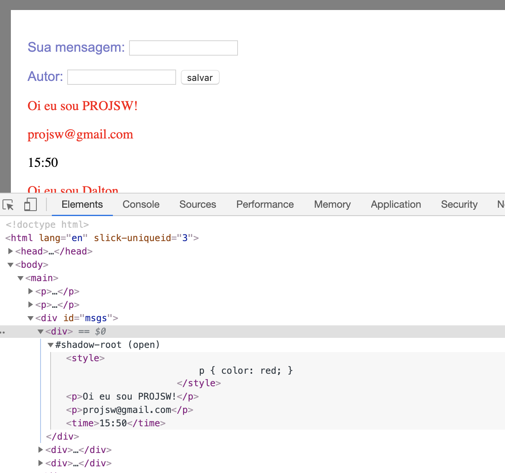

## Exemplo em sala de aula

Em sala de aula decidimos fazer o _frontend_ de um pequeno app de
um mural _web_. O app deve apenas coletar mensagens e publicá-las
na própria página.


Por ora, nos concetramos apenas na parte
frontend. Por isso, devemos assumir que o _backend_ deve ser
prover um _endpoint_ que fornecerá um JSON das mensagens. Para
simular isso, usaremos um arquivo JSON chamado `mensagens.json`
que será servido por nosso servidor de desenvolvimento via HTTP.

### Versão 1

Este é o html de nossa primeira versão do app. Observe que
consiste de uma tag `main` contendo todo o html e a tag `script`
que faz a carga do JavaScript da aplicação. Nenhum css é usado
nesta versão.

```html
<!DOCTYPE html>
<html lang="en">
<head>
  <meta charset="UTF-8">
  <title></title>
</head>
<body>

  <main>
    Sua mensagem: <input type="text">
    Autor: <input type="text">
    <button>salvar</button>
    <div id="msgs"></div>
  </main>

  <script type="module"src="app.js"></script>

</body>
</html>
```

O arquivo `app.js` reúne a lógica. Observe que o _model_, aqui
chamado `messages`, é mantido na variável global
`window.messages`. Obviamente, essa é uma decisão temporária,
para facilitar o desenvolvimento e o _debugging_.

O código principal do módulo define as funções `render()` e
`get_messages()` (sendo esta última uma função assíncrona). Ao
final do módulo, a função `get_messages()` é invocada. Por ser
uma _promise_, usamos o método `then()` para registrar uma função
de callback que irá invocar a função `render()` quando a
_promise_ for cumprida (ou seja, quando as mensagens houverem
sido lidas).

```
window.messages = [];

function render() {
    let $msgs = document.getElementById("msgs");    
    $msgs.innerHTML = '';
    messages.forEach(function (message) {
        let html = `<p>${message.message}</p>
                    <p>${message.author}</p>
                    <time>${message.at}</time>`;

        let novo = document.createElement("div");
        novo.innerHTML = html;
        $msgs.appendChild(novo);
    });
}

async function get_messages() {
    let response = await fetch('mensagens.json');
    let data = await response.json();
    window.messages = data;
}

get_messages()
.then(function () {
    render();
});
```

## Versão 2

Um dos problemas com o código acima é que o isolamento do _model_
é muito precário. Nesta segunda versão, vamos colocar o _model_
em um script separado, chamado `messages.js` e vamos usar o
sistema de módulos de JavaScript para integrar tudo.

O arquivo `messages.js` fica assim:

```javascript
const messages = [];

async function get_messages() {
    let response = await fetch('mensagens.json');
    let data = await response.json();
    messages.push(...data);
}

export {get_messages, messages};
```

Observe que `export` desta vez não usa a palavra-chave `default`.
Nesye caso, optamos por exportar um objeto contendo os dois
objetos que queremos exportar: `get_messages` e `messages`. Veja
que usamos ainda a notação simplificada para definir esse objeto.

Um outro detalhe a se observar no código acima é a linha em que
os dados são colocados em `messages`. Observe que usamos o método
`push` que permite adicionar vários elementos de uma única vez em
um array. Além disso, usamos o operador `...` (chamado _spread_)
que desmonta um _array_ javascript em cada um de seus elementos
independentes. Logo, a chamada `messages.push(...data)` é
equivalente a algo do tipo `messages.push(data[0], data[1],
...)` (obviamente, este último código é apenas pseudo-código e
não funciona).

O código de `app.js`, por sua vez, passa a ser:

```javascript
import {get_messages, messages} from './messages.js';

function render() {
    let $msgs = document.getElementById("msgs");
    $msgs.innerHTML = '';
    messages.forEach(function (message) {
        let html = `<p>${message.message}</p>
                    <p>${message.author}</p>
                    <time>${message.at}</time>`;

        let novo = document.createElement("div");
        novo.innerHTML = html;
        $msgs.appendChild(novo);
    });
}

get_messages()
.then(function () {
    render();
});
```

### Versão 3

Nesta terceira versão, passaremos à questão visual do app. A
primeira coisa que precisamos é decidir o que queremos. Assim,
antes de vermos o código vamos à especificação.

1. Os campos a serem preenchidos devem ser apresentados no
   topo da tela. A cor da fonte deve ser um pouco mais fraca
   dado que não é o elemento gráfico mais importante da
   interface. O tamanho pode ser o mesmo, contudo.

2. A listagem de mensagens deve ser o principal destaque da
   página. Cada mensagem deve ser destacada das demais
   visualmente, com borda e fundo coloridos para facilitar
   a identificação e a percepção de que cada mensagem é uma
   unidade.

3. O texto da mensagem deve ser destacado de forma diferenciada
   em relação ao nome do autor ou da hora em que foi produzida.
   Estes últimos devem usar fonte menor e com cor mais fraca. A
   cor do texto deve ser diferente.

Para implementar isso, começaremos adicionando uma folha de
estilo. Para isso, adicionamos um elemento `link` no cabeçalho do
html.

```html
<head>
  ...
  <link rel="stylesheet" href="estilo.css">
</head>
```

E também adicionamos um arquivo `estilo.css`, contendo as regras
de estilo básicas.

```css
html, body {
    margin: 0;
    padding: 0;
    background: gray;
}

body {
    margin: 20px;
    background: white;
    padding: 20px;
}

p {
    color: #77c;
    font-family: arial;
}
```

A primeira regra acima faz um _reset_ das margens e _padding_ dos
elementos `html` e `body` (e coloca uma cor de _background_
cinza). A segunda estiliza o `body` de forma que fique destacado
do html (a ideia aqui é apenas nos dar noção exata do que está
ocorrendo no DOM e não efetivamente defender que esse é um estilo
apropriado). Finalmente, a terceira regra estiliza o elemento `p`
para uma cor mais suave e a fonte `arial`. É aqui que nos
deparamos com o primeiro problema: essa regra afeta todo o DOM,
incluindo as mensagens.

### Versão 4

De fato, o problema mencionado acima é derivado de outro
problema. Nosso DOM é uma única grande estrutura de dados sobre a
qual os algoritmos de renderização e estilização atuam. Contudo,
conceitualmente, as mensagens são pequenas unidades que
gostaríamos que fossem tratadas de forma mais independentes.

Há várias formas de resolver esse problema. Uma delas é criarmos
classes CSS para especificarmos melhor quais elementos `p` devem
ser afetados ou não. Ou, alternativamente, usar seletores mais
bem pensados para atingir apenas os elementos desejados. Por
exemplo, podemos alterar terceira a regra acima para:

```css
main > p {
    color: #77c;
    font-family: arial;
}
```

Observe que esta regra determina que apenas os parágrafos filhos
imediatos de main sejam afetados pela mudança.

Embora este caminho pareça interessante (e de fato é em algumas
situações), ele tem consequências. Imagine que o app agora evolua
para adicionar um `footer` e um `header`. Se esses elementos
contiverem elementos `p`, eles não são mais afetados pela regra.
E você precisará criar regras específicas para eles, mesmo que
seja para ter o mesmo efeito. Outra situação possível é que o
próprio elemento `main` pode vir a ter uma subestrutura além das
mensagens. Se houver elementos `p` dentro dessa subestrutura que
não sejam filhos diretos de `main`, eles não serão atingidos pela
regra que criamos. Finalmente, há a questão conceitual. A ideia
da regra original é dizer que qualquer parágrafo na aplicação
deve ser estilizado daquela forma, *exceto* as mensagens que
devem ser unidades mais independentes. A regra modificada acima
não reflete isso de maneira adequada.


### Versão 5

Uma ideia que poderíamos experimentar seria estilizar os
parágrafos de dentro das mensagens de forma diferente. Uma forma
de fazer isso poderia ser adicionar uma folha de estilo
específica das mensagens. No código abaixo da função `render()`
uma tentativa é feita, adicionando-se um elemento `style` no html
do `div` de cada mensagem adicionada. Para efeitos de
experimentação, vamos apenas mudar a cor dos parágrafos para
vermelho.

```javascript
function render() {
    let $msgs = document.getElementById("msgs");
    $msgs.innerHTML = '';
    messages.forEach(function (message) {
        let html = `<style>
                        p { color: red; }
                    </style>
                    <p>${message.message}</p>
                    <p>${message.author}</p>
                    <time>${message.at}</time>`;

        let novo = document.createElement("div");
        novo.innerHTML = html;
        $msgs.appendChild(novo);
    });
}
```

O problema dessa abordagem é que embora a redefinição de estilo 
esteja contida dentro do `div` de uma mensagem, ela _vaza_ para
todo o html. E, como resultado, todos os parágrafos passam as ser
estilizados em vermelho, mesmo os que estão fora das mensagens.

Infelizmente, esse é um problema de CSS. As folhas de estilo
podem ser definidas em qualquer ponto do texto do HTML ou do DOM.
Contudo, elas têm validade para toda a árvore.

### Versão 6

A solução para o problema acima se dá através do uso do que se
chama de [Shadow
DOM](https://developers.google.com/web/fundamentals/web-components/shadowdom).
A ideia é que a visualização seja composta não a partir de uma
única grande árvore DOM, mas por um conjunto de pequenas árvores.
Isso permite que cada sub-árvore seja independente das demais em termos de
estilização. Em particular, cada uma pode ter seu próprio conjunto
de regras e essas regras não devem afetar as demais.

Uma forma de entender Shadow DOM é fazer uma analogia: Shadow DOM
é para a estilização e CSS o que o conceito de escopo é para a
programação. De fato, com Shadow DOM podemos falar do escopo das
regras de CSS.

O código abaixo de `render()` evolui sobre a versão anterior.
Nele, usamos a API do browser para criar um Shadow DOM para o
novo elemento e colocamos todo o html que está sendo criado
dentro dessa sub-árvore a que chamamos, no código, de `shadow`.

```javascript
function render() {
    let $msgs = document.getElementById("msgs");
    $msgs.innerHTML = '';
    messages.forEach(function (message) {
        let html = `<style>
                        p { color: red; }
                    </style>
                    <p>${message.message}</p>
                    <p>${message.author}</p>
                    <time>${message.at}</time>`;

        let novo = document.createElement("div");
        let shadow = novo.attachShadow({"mode": "open"});
        shadow.innerHTML = html;
        $msgs.appendChild(novo);
    });
}
```

Perceba que a diferença do código é mínima. Basicamente, a linha
que cria a Shadow DOM e a linha seguinte em que mudamos o
`innerHTML` da shadow ao invés do elemento original. O efeito é
imediato e pode ser observado no _browser_: o estilo das
mensagens agora fica retido em cada mensagem sem afetar o
restante do html. Em termos do DOM, também vale a pena conferir
o resultado. Para isso, inspecione o DOM no seu _browser_. Você
deve ver alguma coisa semelhante à figura abaixo.



É importante observar que o nó original, chamado de _host_ do
Shadow DOM, ainda é mantido no DOM principal. Esse nó e qualquer
sub-árvore desse nó não será renderizado na interface do usuário.
Como ele tem um Shadow DOM anexado, seu espaço na interface será
ocupado pela renderização de sua Shadow DOM.


### Versão 7

A solução anterior nos permite estilizar o DOM das mensagens com
segurança. Segue agora a nova versão de `render()` contendo a
nova folha de estilo, com a segurança de que ela não pode _vazar_
para o restante do DOM.

```javascript
function render() {
    let $msgs = document.getElementById("msgs");
    $msgs.innerHTML = '';
    messages.forEach(function (message) {
        let html = `<style>
                        :host {
                            background: #bfb;
                            padding: 12px;
                            border-radius: 8px;
                            margin-bottom: 2px;
                            display: grid;
                            grid-template-areas:
                                "message message"
                                "at      author";
                            grid-gap: 10px;
                        }
                        p, time {
                            margin: 0;
                            color: gray;
                        }
                        p.message {
                            grid-area: message;
                            color: navy;
                        }
                        p.author {
                            grid-area: author;
                            justify-self: end;
                        }
                    </style>
                    <p class="message">${message.message}</p>
                    <p class="author">${message.author}</p>
                    <time style="grid-area: at;">${message.at}</time>`;

        let novo = document.createElement("div");
        let shadow = novo.attachShadow({"mode": "open"})
        shadow.innerHTML = html;
        $msgs.appendChild(novo);
    });
}
```

### Versão 8

Uma das coisas que incomoda muita gente é ter código CSS dentro
do código JavaScript. Uma solução simples é usar uma folha de
estilo externa tal como fazemos com html convencional. Dito isto,
segue a última versão de `render()` desta vez com a adição de uma
folha de estilo externa.

```javascript
function render() {
    let $msgs = document.getElementById("msgs");
    $msgs.innerHTML = '';
    messages.forEach(function (message) {
        let html = `<link rel="stylesheet" href="message.css">
                    <p class="message">${message.message}</p>
                    <p class="author">${message.author}</p>
                    <time class="at">${message.at}</time>`;

        let novo = document.createElement("div");
        let shadow = novo.attachShadow({"mode": "open"});
        shadow.innerHTML = html;
        $msgs.appendChild(novo);
    });
}
```


### Versão 9

Como última versão de nosso app, vejamos como seria o código de
`render()` se pudéssemos contar com uma
tag customizada para nossa aplicação. Vamos assumir que a tag seja
`ps-message` (`ps` de _projeto de software_) e que essa tag aceite
três atributos: `message`, `author` e `at` que serviriam
justamente para configurar o elemento com o conteúdo associado.
Se a tag existisse, poderíamos escrever código html com ela
assim:

```html
<ps-message message="Olá turma de projsw!"
            author="dalton@ccc.ufcg.edu.br"
            at="10:20"></ps-message>
```

Assim, nossa aplicação deve criar uma nova tag `ps-message` para
cada mensagem recebida do servidor. Isso pode ser conseguido com
o seguinte código para a função `render()` de nosso app.

```javascript
function render() {
    let $msgs = document.getElementById("msgs");
    $msgs.innerHTML = '';
    messages.forEach(function (message) {
        let novo = document.createElement("div");
        novo.innerHTML = `<ps-message message="${message.message}" author="${message.author}" at="${message.at}"></ps-mural>`;
        $msgs.appendChild(novo);
    });
}
```

Observe, contudo, que esta versão do código cria um elemento
`div` apenas para comportar dentro dele o nosso elemento
`ps-message`. Infelizmente, a função `createElement()` da API do
_browser_ não cria um elemento com os atributos iniciais. Por
isso, pode não ser adequado criar diretamente o elemento
`ps-message`. É possível, por outro lado, criar o elemento e
definir os atributos em seguida. O código, nesse caso, ficaria
assim:

```javascript
function render() {
    let $msgs = document.getElementById("msgs");
    $msgs.innerHTML = '';
    messages.forEach(function (message) {
        let novo = document.createElement("ps-message");
        novo.setAttribute('message', message.message);
        novo.setAttribute('author', message.author);
        novo.setAttribute('at', message.at);
        $msgs.appendChild(novo);
    });
}
```

Embora seja um pouco mais longa, é perfeitamente compreensível e
clara. Além disso, esta versão tem a vantagem de criar
exclusivamente o elemento `ps-message`, sem a necessidade do
`div` extra.
